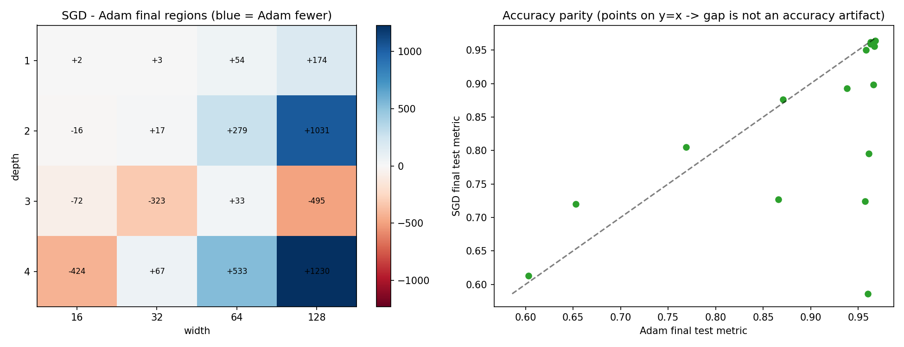
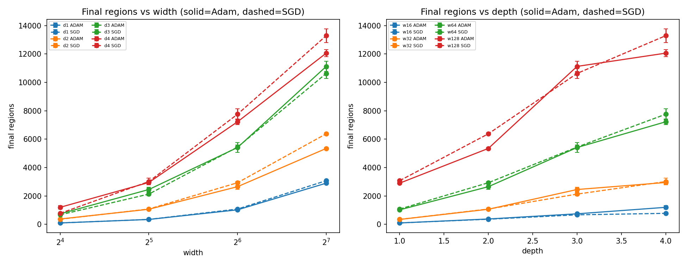
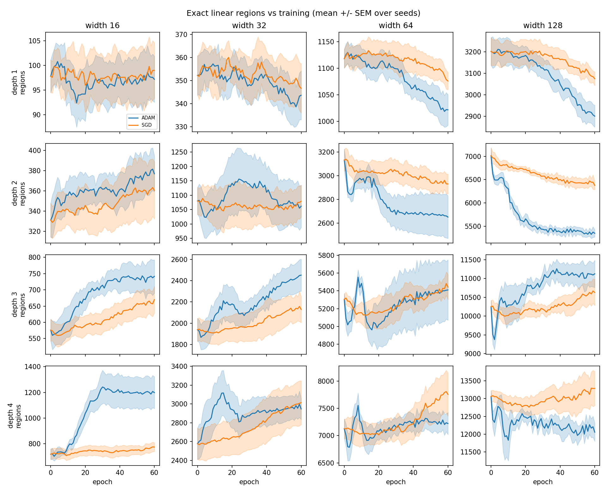
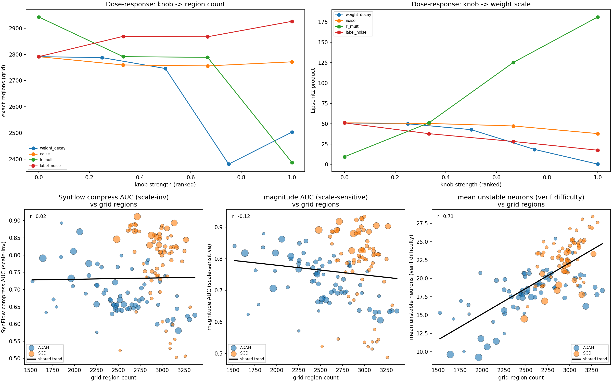

# Findings: linear regions, optimizers, and their downstream effects

Summary of the bullseye region-tracking sweep and the causal-mediation study. All results are on
the 2-D `bullseye` task, where linear regions can be counted **exactly**
(`count_regions(method="grid")`). Reproduce with the commands in each section; figures land in
`figs/`.

---

## 1. Region-tracking sweep (`run_region_sweep.py`)

**Question:** how does the "Adam carves fewer linear regions than SGD" effect scale with
architecture? Matched-init Adam/SGD pairs across depth×width×seed, exact region count tracked
every epoch (4 depths × 4 widths × 5 seeds = 160 trainings).

```bash
uv run python run_region_sweep.py --depths 1 2 3 4 --widths 16 32 64 128 --seeds 5 --epochs 60
uv run python analysis_region_sweep.py --save figs
```

**Findings**

- **Adam produces fewer regions than SGD, and the gap grows with overparameterization.** See the
  **left (heatmap) panel** of the figure below: the cell values are SGD−Adam final regions, and
  the **rightmost column (width 128)** is strongly blue — **+1031** (depth 2) up to **+1230**
  (depth 4). At narrow widths (leftmost columns, 16–32) the cells are near-white/red — the gap is
  small or noisy.
- **Matched init verified:** both optimizers start each cell at an identical region count at
  epoch 0 (visible in the trajectory grid below, where the Adam/SGD curves coincide at epoch 0
  before separating), so the divergence is attributable to the optimizer alone.



*Left: SGD−Adam final regions (blue = Adam fewer) over depth×width — the effect concentrates and
grows in the wide (right) columns. Right: accuracy parity (see caveat).*

- **Absolute region count grows with both width and depth**, and the *optimizer gap* rides on top.
  In the figure below, **left panel (final regions vs width)**: the **dashed SGD lines sit above
  the solid Adam lines** for every depth ≥ 2, and the separation widens toward width 128. The
  **right panel (vs depth)** shows the same ordering across depth.



*Solid = Adam, dashed = SGD. SGD (dashed) rides above Adam (solid) at the higher-capacity end.*

The per-epoch trajectories (one panel per depth×width cell; Adam vs SGD, mean ± SEM) show the two
optimizers starting together and Adam bending downward over training:



**Caveat.** The **right (scatter) panel of the heatmap figure** is accuracy parity: many points
fall **below the y = x line**, i.e. SGD reaches lower test accuracy than Adam in several
deeper/narrower cells (SGD undertrains in 60 epochs), so a few region gaps are partly confounded
with an accuracy gap. The points near the top-right (both ≈0.95 accuracy) are the clean cells, and
they still show Adam with fewer regions.

---

## 2. Causal-mediation study (`run_causal_sweep.py`)

**Question:** is region count a *cause* of the downstream costs (compressibility, verifiability),
or just correlated with the optimizer? We **intervene** on region count with four knobs that are
*not* the optimizer — weight decay, input noise, learning rate, label noise — building a
population of 140 models (width 64, depth 2), then test whether the outcomes track region count
regardless of what produced it.

```bash
uv run python run_causal_sweep.py --seeds 5 --epochs 60
uv run python analysis_causal.py --save figs
```

**Identification.** (i) Scale-invariant outcomes (SynFlow / balanced-magnitude compressibility)
remove Lipschitz from the outcome side; (ii) the knobs **decorrelate** region count from Lipschitz,
so partial regression can separate the two; (iii) a shared-trend scatter and a matched-region-bin
test check whether the optimizer has any residual effect at fixed region count.

The **top row of the figure below verifies the intervention worked.** Top-left (knob → region
count): **weight decay (blue) and learning rate (green) drive region count down**, **label noise
(red) drives it up** — the knobs span a wide region range. Top-right (knob → Lipschitz):
**learning rate (green) drives Lipschitz sharply *up* while lowering regions, whereas weight decay
(blue) lowers both** — this opposite pairing is what decorrelates region count from weight scale
and lets the regression separate them.

**Verdict: the causal claim succeeds for verifiability and fails for compressibility.**



*Top row: dose-response (knobs move region count and Lipschitz). Bottom row, left→right: SynFlow
AUC, magnitude AUC, and unstable neurons, each vs exact grid region count; blue = Adam, orange =
SGD, marker size ∝ Lipschitz, black line = shared trend across both optimizers.*

### ✅ Region count causally drives verification difficulty

- **Bottom-right panel** (mean unstable neurons vs exact region count): **r = 0.71**, and the blue
  (Adam) and orange (SGD) clouds fall on the **same black trend line** — the optimizer acts *only
  through* region count.
- Partial regression `unstable ~ region + lipschitz` (standardized): **β_region = 0.60,
  R² = 0.65**, while **β_lipschitz = −0.39** (wrong sign to be the driver). The effect is region
  count, not weight scale.
- This is exactly the "bridge metric" of `applications.md` §1 (unstable neurons = local region
  density in the verifier's units), now causally confirmed.

### ❌ Region count does not explain compressibility (on bullseye)

- **Bottom-left panel** (SynFlow-AUC vs region count): the trend line is **flat, r ≈ 0.02**, and
  the blue (Adam) and orange (SGD) clouds are **vertically separated** rather than sharing one
  curve — i.e. a residual optimizer effect that region count does not explain (partial R² ≈ 0.05).
  The **bottom-middle panel** (magnitude AUC) is similar (r = −0.12).
- Matched-region-bin test: at *equal* region count, SGD is if anything slightly **more**
  compressible (gap −0.08 to −0.14 in SynFlow AUC). The weak Adam edge hinted at on MNIST does
  **not** replicate as a causal effect here.

### Why the split

Verification cost is almost definitionally region density (case-splits over an ε-ball = unstable
neurons), so the mechanism is tight. Compressibility depends on the weight *distribution* and
redundancy, which region count does not pin down — especially on a tiny, easy, heavily
overparameterized 2-D task where pruning-frontier AUC is dominated by other factors.

**Caveats.**
- Region count is the *dominant* but not the *sole* factor for verification (R² = 0.65, and the
  matched-bin test shows a small residual optimizer gap at high region counts).
- The `local` estimator was the *weakest* predictor (β = 0.23 vs grid 0.60 / pairwise 0.55) — as
  implemented it saturates on bullseye; the exact `grid` and `pairwise` metrics carry the signal.
  The *concept* that verification is local is right; this particular local estimator is too coarse
  here.
- The compressibility null is specific to bullseye; the honest next test is the causal sweep on a
  task that actually stresses capacity (MNIST / CIFAR-10).

---

## Headline

On bullseye, with region count measured **exactly**, there is now a genuine *causal*
demonstration that **linear-region count drives verifiability** — it predicts unstable-neuron
count with R² = 0.65 after conditioning on weight scale, with both optimizers falling on a single
curve — and an honest *null* for compressibility on this task. The strongest paper-ready claim is
the verification one.

## Suggested next steps

- Port the causal sweep to MNIST / CIFAR-10 (compressibility deserves a capacity-stressing task).
- Restrict the region-sweep headline to accuracy-matched cells (or train SGD longer) to remove the
  residual accuracy confound.
- Tighten the verification mediation result into a standalone figure/writeup.
